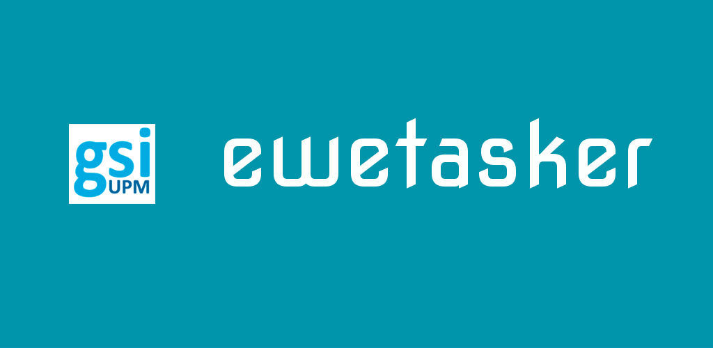

#Installation
First of all, clone the git project locally and access to ewe-tasker directory.
```
git clone https://github.com/carlosmg95/tfg.git ewe-tasker
cd ewe-tasker

```

# Step by step configuration
#Build docker image

Build the *carlosmg95/ewetasker* docker image from build Dockerfile

```
docker build -t carlosmg95/ewetasker .

```

Run script
```
sh reset.sh
```

Create a docker network

```
docker network create ewetaskernet

```
Run a default MongoDB docker container.
```
docker run -d --name ewemongo -v $PWD/mongodb-data:/data/db --net ewetaskernet mongo
```
Access mongo console and create the default user and password in the *applicationdb* database
```
docker exec -it ewemongo mongo applicationdb

use applicationdb

db.createUser({ user: 'client', pwd: 'gsimongodb2017', roles: [ { role: "readWrite", db: "applicationdb" } ] });

exit

```
Restore the default channel, rules and users from the example backup (optional)

```
docker run --net ewetaskernet --rm -v $PWD/mongo-example:/mongo-example  mongo mongorestore --host ewemongo /mongo-example

```

Finally, run in port 8080 setting up the *MONGO_HOST* env variable and link with your mongodb docker instance created before.
```
docker run -d --name ewetasker --net ewetaskernet -e MONGO_HOST=ewemongo -p 8080:80 carlosmg95/ewetasker

```
Access your own Ewe Tasker server
```

http://localhost:8080

```
#Reset docker containers
If you experienced any error following the previous steps, the try to stop/remove the containers related to this project.

```
sh reset.sh

```

# Telegram Chatbot configuration
Create a user whose name is "admin"

Visit the url:

```

http://<my-ewetasker-server-path>/telegram-bot/unset.php

```

Visit the url:

```

http://<my-ewetasker-server-path>/telegram-bot/set.php?host=https://<my-ewetasker-server-public-path>

```

my-ewetasker-server-public-path can't be localhost, I recommend to use "ngrok"
